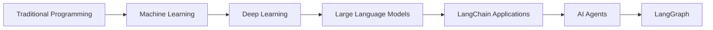
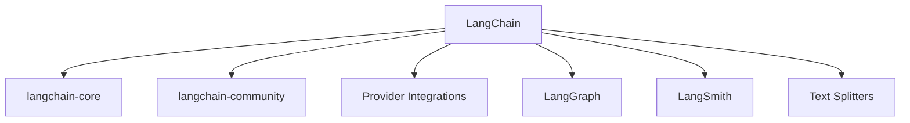
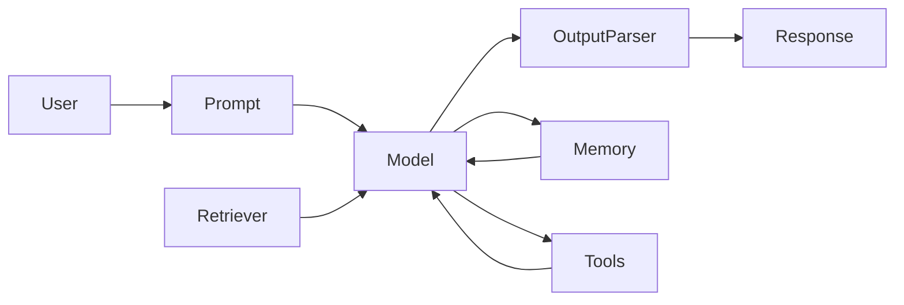

# Chapter 1: Introduction to LangChain

> **Goal:** By the end of this chapter, you will understand **what LangChain is**, **why it was created**, **the problems it solves**, **how it fits into the modern AI ecosystem**, and **when you should (or should not) use it**.

---

# What is LangChain?

**LangChain** is an open-source framework for building applications powered by **Large Language Models (LLMs)**.

Instead of calling an AI model directly, LangChain provides reusable building blocks for creating applications that can:

* Chat with users
* Search documents
* Answer questions from PDFs
* Use external tools
* Access databases
* Call APIs
* Remember previous conversations
* Perform reasoning
* Build AI agents
* Build Retrieval-Augmented Generation (RAG) systems
* Create multi-agent workflows

In simple terms:

> **LangChain helps developers build complete AI applications rather than making isolated calls to an LLM.**

---

## A Simple Analogy

Imagine building a smart personal assistant.

Without LangChain, you would have to manually write code for:

* Prompt creation
* Conversation history
* API calls
* Tool execution
* Parsing responses
* Error handling
* Database retrieval
* Streaming
* Memory
* Logging

Your application might look like this:

```text
User
   │
   ▼
Write Prompt
   │
   ▼
Call OpenAI API
   │
   ▼
Parse Response
   │
   ▼
Store Chat History
   │
   ▼
Search Documents
   │
   ▼
Call Database
   │
   ▼
Format Final Response
```

A lot of repetitive work.

---

With LangChain:

```text
User
   │
   ▼
LangChain
   │
   ├── Prompt
   ├── Memory
   ├── Retriever
   ├── Tools
   ├── Output Parser
   ├── Streaming
   └── LLM
   │
   ▼
Response
```

LangChain handles much of the orchestration so you can focus on application logic.

---

# Why LangChain Exists

Large Language Models are excellent at generating text.

However, real-world applications require much more than text generation.

For example, imagine asking:

> "Summarize yesterday's sales from my company database."

A language model alone:

* Cannot directly access your database.
* Does not know your company’s internal data.
* Cannot reliably call APIs or external tools by itself.

An application must:

1. Receive the user request.
2. Understand the intent.
3. Query the database.
4. Retrieve relevant information.
5. Construct a prompt with that information.
6. Send it to the model.
7. Format the response.
8. Return it to the user.

LangChain provides components to coordinate these steps.

---

# Problems LangChain Solves

## 1. Prompt Management

Instead of manually concatenating strings:

```python
prompt = f"Answer the question: {question}"
```

LangChain provides reusable prompt templates.

---

## 2. Conversation Memory

LLMs are stateless by default.

Without memory:

```
User: My name is Alice.

...

User: What's my name?

LLM:
I don't know.
```

LangChain can manage conversation history so context is preserved.

---

## 3. Retrieval-Augmented Generation (RAG)

LLMs do not automatically know your private documents.

LangChain helps:

* Load documents
* Split text
* Generate embeddings
* Store vectors
* Retrieve relevant context
* Provide it to the model

---

## 4. Tool Usage

Modern AI applications often need to:

* Search the web
* Read files
* Query databases
* Call APIs
* Perform calculations

LangChain provides abstractions for integrating these capabilities.

---

## 5. Agent Workflows

Instead of following a fixed sequence of steps, some applications need the AI to decide:

* Which tool to use
* In what order
* Whether another step is required

LangChain supports building these agentic workflows.

---

## 6. Model Abstraction

Switching providers can be cumbersome if your code depends on a specific API.

LangChain offers a consistent interface across many model providers, making it easier to swap models with minimal changes.

---

# Evolution of AI Development



---

# Brief History of LangChain

| Year        | Milestone                                                                                 |
| ----------- | ----------------------------------------------------------------------------------------- |
| **2022**    | LangChain introduced by Harrison Chase.                                                   |
| **2023**    | Rapid adoption with support for many LLM providers and integrations.                      |
| **2024**    | Greater focus on modular packages and production tooling such as LangGraph and LangSmith. |
| **Present** | Used for RAG systems, AI agents, enterprise applications, and research workflows.         |

> **Note:** LangChain evolves quickly. Modern projects typically combine **LangChain**, **LangGraph**, and **LangSmith** depending on the application's needs.

---

# The LangChain Ecosystem

LangChain has grown into an ecosystem of related libraries and tools.



## Common Components

| Component               | Purpose                                                                    |
| ----------------------- | -------------------------------------------------------------------------- |
| **langchain-core**      | Core abstractions such as prompts, messages, runnables, and parsers.       |
| **langchain-community** | Community-maintained integrations.                                         |
| **Provider packages**   | Integrations for model providers (for example, OpenAI, Anthropic, Google). |
| **LangGraph**           | Build stateful and multi-agent workflows.                                  |
| **LangSmith**           | Tracing, debugging, evaluation, and monitoring.                            |

---

# Core Building Blocks



---

# Real-World Use Cases

## Customer Support

* Chatbots
* Ticket summarization
* FAQ systems
* Help desk assistants

---

## Document Question Answering

* PDF Chat
* Legal documents
* Research papers
* Contracts

---

## Healthcare

* Medical note summarization
* Patient document search
* Clinical knowledge retrieval

> **Caution:** Healthcare applications require rigorous validation, privacy controls, and human oversight.

---

## Finance

* Financial report analysis
* Risk analysis
* Investment research
* Portfolio summaries

---

## Education

* AI tutors
* Course assistants
* Homework support
* Personalized learning

---

## Software Development

* Code assistants
* Documentation generation
* API explanation
* Bug analysis

---

## Human Resources

* Resume analysis
* Interview preparation
* Candidate matching

---

## Business Intelligence

* SQL agents
* Dashboard assistants
* KPI summaries
* Report generation

---

## Research

* Literature reviews
* Knowledge extraction
* Citation assistance

---

# When Should You Use LangChain?

Use LangChain when your application needs one or more of the following:

* Prompt management
* Retrieval from documents or databases
* Multiple LLM providers
* Memory
* Tool integration
* AI agents
* Structured outputs
* Streaming responses
* Modular workflows

---

# When Might You Not Need LangChain?

If your application only sends a prompt to a model and displays the response, using the provider's SDK directly may be simpler.

Examples:

* Simple text completion
* Basic translation
* Grammar correction
* Short summarization scripts

As application complexity grows—such as adding retrieval, tools, or agents—a framework like LangChain can reduce repetitive orchestration code.

---

# Advantages of LangChain

| Advantage         | Description                                           |
| ----------------- | ----------------------------------------------------- |
| Modular           | Build applications from reusable components.          |
| Extensible        | Supports many providers and integrations.             |
| Provider-agnostic | Easier to switch between compatible model providers.  |
| Production-ready  | Works alongside LangSmith for tracing and evaluation. |
| RAG Support       | Includes components for document retrieval workflows. |
| Agent Support     | Enables tool-using AI agents.                         |
| Streaming         | Supports streaming outputs in many integrations.      |
| Async Support     | Designed to work well with asynchronous applications. |

---

# Limitations

| Limitation           | Explanation                                                    |
| -------------------- | -------------------------------------------------------------- |
| Learning curve       | There are many abstractions to understand.                     |
| Rapid evolution      | APIs and best practices can change over time.                  |
| Abstraction overhead | Very simple applications may not benefit from the extra layer. |
| Provider differences | Not every provider supports every feature in the same way.     |

---

> 💡 **Tip:** Learn the core concepts—prompts, messages, runnables, and retrieval—before diving into agents. A strong foundation makes advanced topics much easier.

> ⚠️ **Common Mistakes**
>
> * Trying to learn every LangChain component at once.
> * Building agents before understanding prompts and retrieval.
> * Assuming the model "remembers" previous interactions without explicit conversation history.
> * Relying on an LLM's internal knowledge instead of using retrieval for private or frequently changing data.

> ✅ **Best Practices**
>
> * Start with simple prompt → model → output pipelines.
> * Keep prompts modular and reusable.
> * Use retrieval for external knowledge rather than embedding large documents directly into prompts.
> * Add memory only when your application genuinely needs conversational context.
> * Prefer clear, testable workflows over unnecessarily complex agent systems.

> 🚀 **Pro Tips**
>
> * Master **LCEL (LangChain Expression Language)** early—it underpins many modern LangChain workflows.
> * Learn **RAG** before building sophisticated agents; many practical applications benefit more from high-quality retrieval than autonomous decision-making.
> * Become comfortable with **LangGraph** for long-running, stateful, or multi-agent systems.
> * Use **LangSmith** to trace and debug complex pipelines in production.

---

# Chapter Summary

In this chapter, you learned:

* What LangChain is and why it exists.
* The problems it helps solve, including prompt management, retrieval, memory, and tool integration.
* How LangChain fits into the broader AI application ecosystem.
* Typical real-world use cases.
* Situations where LangChain is—and is not—the right choice.
* The main advantages and limitations of using the framework.

---

## What's Next?

In **Chapter 2: Installation & Project Setup**, you'll learn how to:

* Set up Python environments.
* Install LangChain using **pip**, **uv**, and **Poetry**.
* Configure API keys securely.
* Organize a clean LangChain project.
* Verify your installation with your first runnable LangChain application.
