# Chapter 24 — LangGraph

> **"LangChain gives your LLM capabilities. LangGraph gives your application a brain."**

---

# What is LangGraph?

LangGraph is a **graph-based orchestration framework** for building **stateful**, **multi-step**, **agentic AI applications**.

Instead of executing prompts in a straight line, LangGraph models your application as a **graph** where:

- Nodes perform work
- Edges decide what happens next
- State carries information
- Loops allow reasoning
- Conditional routing enables decision making
- Memory lets conversations continue over time

Think of LangGraph as the workflow engine for AI applications.

---

# Why LangGraph?

Traditional chains look like this:

```text
User
   │
   ▼
Prompt
   │
   ▼
LLM
   │
   ▼
Output
```

But real AI systems are rarely this simple.

A production chatbot may need to

- classify the question
- search documents
- call APIs
- ask clarification questions
- retry failures
- remember previous conversations
- use multiple LLMs
- wait for human approval

This becomes difficult using only sequential chains.

LangGraph solves this elegantly.

---

# Analogy

Imagine building a GPS navigation system.

A normal LangChain chain is like:

> Drive from Home → Office

Only one road.

LangGraph is like Google Maps.

It can

- take alternate roads
- avoid traffic
- go back
- take loops
- reroute
- remember destination
- pause
- resume

Exactly the same idea.

---

# LangGraph Architecture

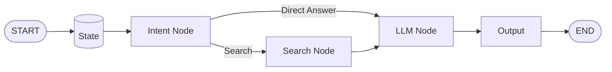

---

# Core Components

| Component | Purpose |
|------------|----------|
| State | Shared application data |
| Node | Performs work |
| Edge | Connects nodes |
| Conditional Edge | Chooses next node |
| Graph | Complete workflow |
| Memory | Persists state |
| Checkpoint | Saves execution progress |
| Cycles | Enables repeated reasoning |

---

# State

State is the **shared memory** of your graph.

Every node

- reads the state
- updates the state
- passes it to the next node

Think of state as a backpack carried through the workflow.

---

## Example State

```python
from typing import TypedDict

class ChatState(TypedDict):
    question: str
    answer: str
    intent: str
```

Initially

```python
{
    "question": "What is AI?"
}
```

Later

```python
{
    "question": "What is AI?",
    "intent": "education",
    "answer": "Artificial Intelligence..."
}
```

Every node contributes something.

---

# State Flow

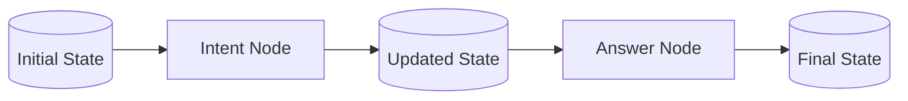

---

# Why State Matters

Without state

```text
Node A
↓

Node B

↓

Node C
```

Nodes cannot share information.

With state

```text
Shared State

↓

Node A

↓

Shared State

↓

Node B

↓

Shared State

↓

Node C
```

---

# Example 1 — Basic State

## Install

```bash
pip install -U langgraph langchain langchain-openai
```

---

```python
from typing import TypedDict

from langgraph.graph import StateGraph, START, END


class MyState(TypedDict):
    message: str


def greet(state: MyState):
    return {
        "message": state["message"] + " Welcome!"
    }


builder = StateGraph(MyState)

builder.add_node("greet", greet)

builder.add_edge(START, "greet")
builder.add_edge("greet", END)

graph = builder.compile()

result = graph.invoke(
    {"message": "Hello"}
)

print(result)
```

Expected output

```python
{
 'message': 'Hello Welcome!'
}
```

---

# Nodes

A node is simply a Python function.

It

- receives state
- performs work
- returns updates

```python
def my_node(state):
    ...
    return {}
```

Think of a node as one worker in a factory.

---

# Node Lifecycle

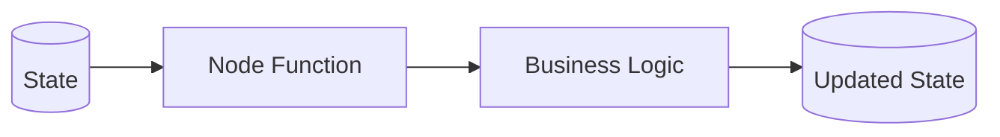

---

# Example Node

```python
def uppercase(state):
    return {
        "text": state["text"].upper()
    }
```

---

# Multiple Nodes

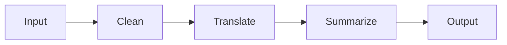

---

# Example

```python
from typing import TypedDict
from langgraph.graph import StateGraph, START, END


class State(TypedDict):
    text: str


def clean(state):
    return {"text": state["text"].strip()}


def uppercase(state):
    return {"text": state["text"].upper()}


builder = StateGraph(State)

builder.add_node("clean", clean)
builder.add_node("upper", uppercase)

builder.add_edge(START, "clean")
builder.add_edge("clean", "upper")
builder.add_edge("upper", END)

graph = builder.compile()

print(graph.invoke({"text": " hello "}))

```

Output

```
HELLO
```

---

# Edges

Edges connect nodes.

They define workflow order.

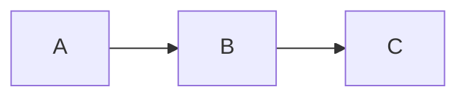

Without edges

there is no execution path.

---

# Conditional Routing

One of LangGraph's biggest strengths.

Instead of

```
Always go here
```

we can say

```
If intent is X

go here

otherwise

go there
```

---

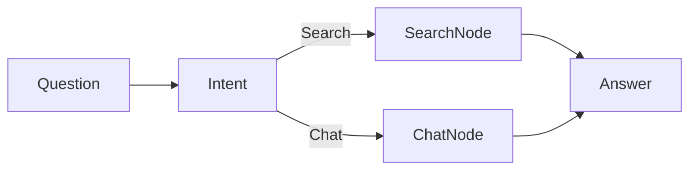

---

# Example

```python
def router(state):
    if state["intent"] == "search":
        return "search"

    return "chat"
```

---

Adding conditional edges

```python
builder.add_conditional_edges(
    "intent",

    router,

    {
        "search": "search_node",
        "chat": "chat_node",
    },
)
```

---

# Real Example

Suppose user asks

```
Who is Elon Musk?
```

Intent

```
Search
```

Graph

```
Retriever

↓

LLM

↓

Answer
```

---

User asks

```
Write a poem.
```

Intent

```
Creative
```

Graph

```
LLM

↓

Answer
```

No retrieval needed.

---

# Cycles

Normal chains cannot loop naturally.

LangGraph can.

---

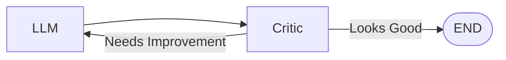

This enables

- self-reflection
- iterative refinement
- planning
- retries
- agent reasoning

---

# Example

```python
def review(state):
    if state["score"] > 80:
        return "finish"

    return "rewrite"
```

The graph continues until quality is acceptable.

---

# Memory

Memory means

> The graph remembers previous executions.

Without memory

```
Hello

↓

Forget everything
```

With memory

```
Hello

↓

Remember

↓

Continue tomorrow
```

---

# Types of Memory

| Type | Description |
|----------|----------------|
| Short-term | During graph execution |
| Long-term | Across sessions |
| Checkpoint | Resume execution |
| External | Database/Redis |

---

# Checkpointing

LangGraph supports checkpointing.

If execution stops

```
Node 1

↓

Node 2

↓

Power failure
```

Resume

```
Node 3
```

instead of restarting.

---

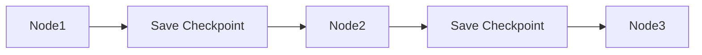

---

# Example Using Memory

```python
from langgraph.checkpoint.memory import InMemorySaver

memory = InMemorySaver()

graph = builder.compile(
    checkpointer=memory
)
```

Invoke

```python
graph.invoke(
    {"message": "Hi"},
    config={
        "configurable": {
            "thread_id": "123"
        }
    },
)
```

Next invocation with same thread

```
123
```

continues conversation.

---

# Example 2 — Chatbot Graph

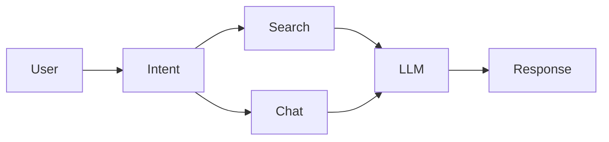

---

# Example 3 — RAG Workflow

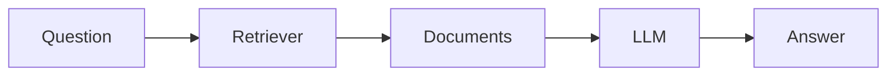

---

# Example 4 — Agent

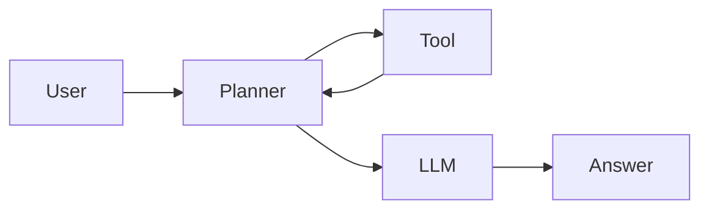

Planner keeps looping until done.

---

# Example 5 — Human Approval

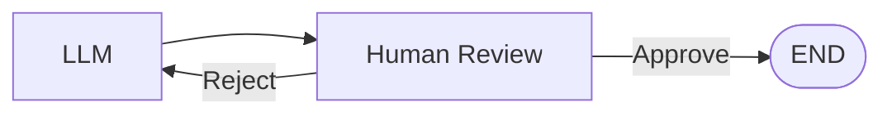

Very common in enterprise AI.

---

# Example 6 — Multi-Agent Collaboration

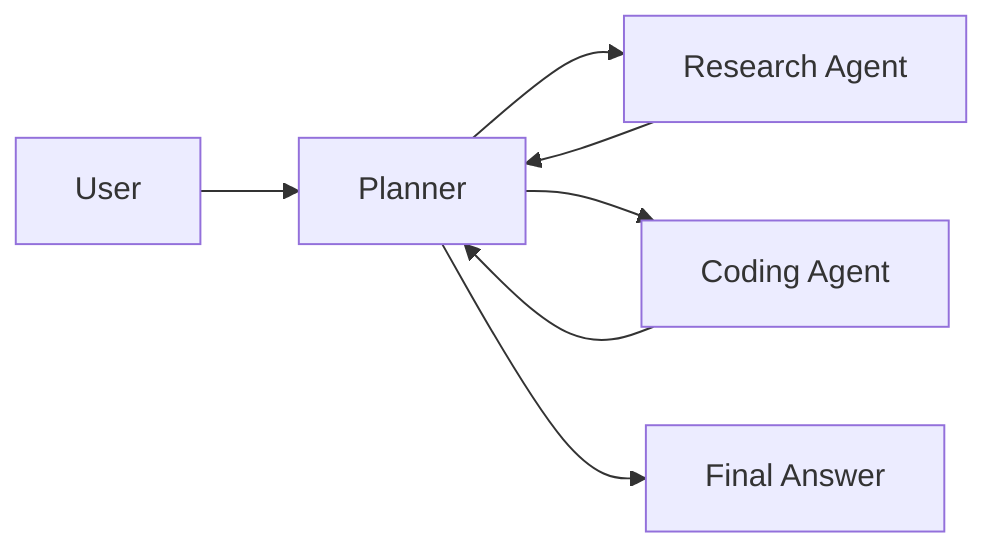

---

# LangGraph vs LangChain

| Feature | LangChain | LangGraph |
|----------|-----------|------------|
| Sequential workflows | ✅ | ✅ |
| Loops | ❌ | ✅ |
| Conditional routing | Limited | ✅ |
| Stateful | Limited | ✅ |
| Memory | Basic | Advanced |
| Checkpoints | ❌ | ✅ |
| Agent workflows | Basic | Excellent |
| Multi-agent | Difficult | Easy |
| Human approval | Limited | Excellent |
| Production orchestration | Moderate | Excellent |

---

# When to Use LangChain

Use LangChain if

- Prompt templates
- Output parsers
- Tools
- Retrieval
- Simple chatbot
- Basic RAG
- Sequential pipelines

---

# When to Use LangGraph

Use LangGraph if

- AI agents
- Multi-agent systems
- Reflection
- Planning
- Human approval
- Retry logic
- Long conversations
- Stateful workflows
- Enterprise orchestration

---

# Relationship Between Them

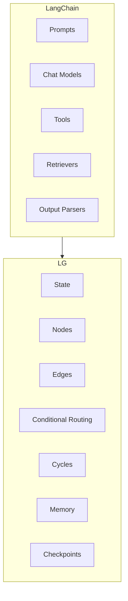

---

# Complete Mental Model

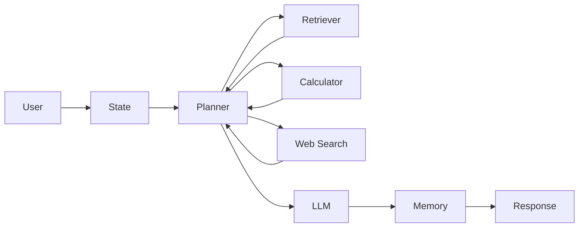

Bonus: Execution Flow Inside LangGraph

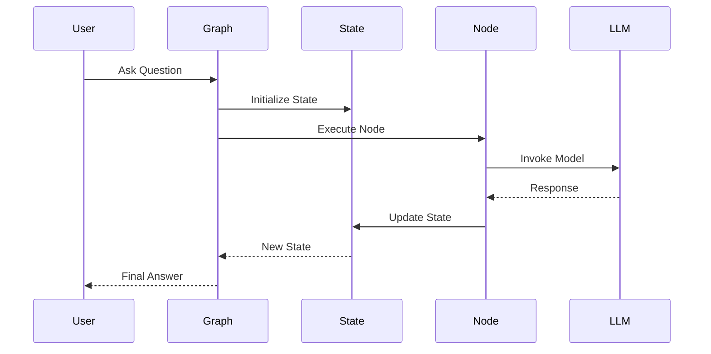
---

# Common Errors

### Error

```
Missing state key
```

Fix

Return every required state field or define optional keys appropriately.

---

### Error

```
Unknown node
```

Fix

Ensure every node is registered using

```python
builder.add_node(...)
```

before referencing it in an edge.

---

### Error

```
Conditional edge returns invalid label
```

Fix

Ensure the router returns one of the labels defined in `add_conditional_edges()`.

---

### Error

```
Conversation does not persist
```

Fix

Use a checkpointer (for example, `InMemorySaver`) and pass a consistent `thread_id` in the graph configuration.

---

## 💡 Tips

- Keep nodes focused on a single responsibility.
- Store only shared information in the graph state.
- Use conditional routing instead of deeply nested `if` statements inside nodes.
- Visualize complex graphs early using Mermaid diagrams.

---

## ⚠️ Common Mistakes

- Making one node perform too many tasks.
- Storing large objects (such as full document collections) directly in state.
- Forgetting to define all possible routing outcomes.
- Using loops without a clear termination condition, leading to infinite execution.

---

## ✅ Best Practices

- Design state schemas with `TypedDict` for clarity and type safety.
- Make node functions deterministic whenever possible.
- Separate orchestration (LangGraph) from business logic (your Python functions).
- Use checkpointing for long-running or human-in-the-loop workflows.
- Test each node independently before assembling the graph.

---

## 🚀 Pro Tips

- Combine LangGraph with LangChain tools, retrievers, and prompt templates to build sophisticated AI systems.
- Build reusable subgraphs for common workflows such as RAG, planning, or tool execution.
- Add observability with LangSmith or callbacks to trace node execution and debug complex graphs.
- Use LangGraph as the orchestration layer for production-grade AI applications while leveraging LangChain's rich ecosystem of integrations.

---

# Chapter Summary

By the end of this chapter, you should understand that:

- **State** is the shared data that flows through the graph.
- **Nodes** are Python functions that perform work.
- **Edges** determine the execution path.
- **Conditional routing** enables dynamic decision making.
- **Cycles** allow iterative reasoning, retries, and self-reflection.
- **Memory** preserves conversation and execution state across interactions.
- **Checkpointing** enables pausing and resuming long-running workflows.
- **LangChain** provides AI building blocks, while **LangGraph** orchestrates them into intelligent, stateful, production-ready systems.

With LangGraph, you move from building simple AI pipelines to designing **autonomous, resilient, and enterprise-scale AI applications**.
