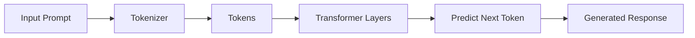

Excellent. Since you're building this as a long-term LangChain reference, I'd recommend one small refinement to the order.

Instead of:

1. LLMs
2. Chat Models
3. Messages
4. Prompts
5. Prompt Templates

use this learning sequence:

1. LLMs
2. Chat Models
3. Prompts
4. Prompt Templates
5. Messages

The reason is that a beginner first understands what an LLM is, then how chat models differ from traditional LLMs, then learns prompting, and only afterward learns why chat models require structured messages (`SystemMessage`, `HumanMessage`, `AIMessage`) instead of a single text prompt.

---

# 3.1 Core Concepts — Foundation

---

# Overview

Before building chains, agents, or Retrieval-Augmented Generation (RAG) systems, it's essential to understand the five foundational concepts that every LangChain application is built upon.

These concepts form the base of almost every AI application developed with LangChain.

```text
               User Input
                    │
                    ▼
              Prompt / Messages
                    │
                    ▼
             Prompt Template
                    │
                    ▼
              Chat Model / LLM
                    │
                    ▼
             AI Generated Output
```

---

| Concept         | Purpose                           | Used By          |
| --------------- | --------------------------------- | ---------------- |
| LLM             | Generates text                    | Everything       |
| Chat Model      | Conversational interface over LLM | Chatbots, Agents |
| Prompt          | Instructions for the model        | Every request    |
| Prompt Template | Dynamic prompt generation         | Production apps  |
| Messages        | Structured conversation format    | Chat Models      |

---

# 1. LLMs (Large Language Models)

## Definition

A **Large Language Model (LLM)** is an artificial intelligence model trained on massive amounts of text to predict the next token (word or subword) in a sequence.

Although they appear to "understand" language, LLMs fundamentally perform sophisticated pattern prediction based on their training data.

Examples include:

* GPT-4.1
* Claude
* Gemini
* Llama 3
* Mistral
* DeepSeek

---

## Real-World Analogy

Imagine an experienced librarian who has read millions of books.

When you ask a question, the librarian doesn't search the internet in real time. Instead, they use everything they've already read to generate the most likely and useful answer.

An LLM works similarly: it generates responses from patterns learned during training.

---

## Why LLMs Exist

Before LLMs, many NLP tasks required separate models:

* Translation
* Summarization
* Classification
* Sentiment analysis
* Question answering
* Code generation

LLMs unified these capabilities into a single general-purpose model driven by prompts.

---

## How an LLM Works (High Level)



### Step-by-Step

1. User enters text.
2. The text is tokenized.
3. Tokens pass through transformer layers.
4. The model predicts the most probable next token.
5. Tokens are generated sequentially until completion.

---

## LLM vs Traditional Software

| Traditional Program | LLM                       |
| ------------------- | ------------------------- |
| Rule-based          | Probability-based         |
| Deterministic       | Probabilistic             |
| Exact logic         | Learned patterns          |
| Fixed outputs       | Context-dependent outputs |

---

## When to Use an LLM

Use an LLM for tasks such as:

* Answering questions
* Summarizing text
* Writing content
* Translating languages
* Generating code
* Extracting information
* Brainstorming ideas

---

## Advantages

* Extremely flexible
* Natural language interface
* Few-shot learning
* Supports many tasks with one model
* Generates human-like responses

---

## Limitations

* Can hallucinate facts
* Training data may be outdated
* No inherent reasoning guarantee
* Sensitive to prompt wording
* Can be expensive at scale

---

## Runnable Example (OpenAI)

### Install

```bash
pip install -U langchain langchain-openai
```

### Set Environment Variable

```bash
export OPENAI_API_KEY="your_api_key"   # Linux/macOS

# Windows PowerShell
$env:OPENAI_API_KEY="your_api_key"
```

### Code

```python
from langchain_openai import ChatOpenAI

# Create the model
llm = ChatOpenAI(
    model="gpt-4.1-mini",
    temperature=0
)

# Invoke the model
response = llm.invoke("Explain gravity in one sentence.")

print(response.content)
```

### Expected Output

```text
Gravity is the force that attracts objects with mass toward one another.
```

### Explanation

* `ChatOpenAI` creates the model interface.
* `temperature=0` favors consistent, deterministic responses.
* `invoke()` sends the prompt and returns an AI message.
* `.content` extracts the generated text.

---

> 💡 **Tip:** Even though the class is named `ChatOpenAI`, it can handle simple text prompts as well as conversational inputs.

---

## Common Mistakes

⚠️ Treating an LLM as a search engine. LLMs generate responses from learned patterns and do not automatically retrieve live information.

⚠️ Assuming outputs are always correct. Always verify important facts.

⚠️ Using high temperature when deterministic behavior is required.

---

## Best Practices

✅ Write clear, specific prompts.

✅ Keep prompts concise when possible.

✅ Validate outputs for critical applications.

✅ Use retrieval (RAG) for domain-specific or up-to-date knowledge.

---

## Interview Questions

**Q1. What is an LLM?**

A model trained on large text corpora to predict the next token, enabling it to perform many language tasks.

**Q2. Why can LLMs hallucinate?**

Because they generate statistically likely continuations rather than verifying facts against a trusted knowledge source.

---

# 2. Chat Models

## Definition

A **Chat Model** is an LLM optimized to work with structured conversations rather than a single block of text.

Instead of plain strings, chat models consume and produce **messages**.

---

## Why Chat Models Exist

Conversations have roles:

* System instructions
* User requests
* Assistant replies

Representing these separately gives the model clearer context and more controllable behavior.

---

## Analogy

Think of a meeting:

* **System** → Meeting agenda and rules.
* **Human** → Questions from attendees.
* **AI** → Responses from the presenter.

Keeping these roles separate avoids confusion.

---

## LLM vs Chat Model

| LLM                     | Chat Model                                 |
| ----------------------- | ------------------------------------------ |
| Single text input       | Structured messages                        |
| Best for completion     | Best for conversations                     |
| Limited role separation | Supports system, user, and assistant roles |
| Simpler interface       | Better conversational context              |

---

## Runnable Example

```python
from langchain_openai import ChatOpenAI
from langchain_core.messages import HumanMessage

chat = ChatOpenAI(
    model="gpt-4.1-mini",
    temperature=0
)

response = chat.invoke([
    HumanMessage(content="What is LangChain?")
])

print(response.content)
```

### Expected Output

```text
LangChain is a framework for building applications powered by large language models...
```

---

## When to Use

Use chat models for:

* AI assistants
* Customer support bots
* Coding assistants
* Multi-turn conversations
* Agents

---

## Advantages

* Maintains conversational context.
* Supports role-based instructions.
* Easier integration with memory and tools.

---

## Limitations

* Slightly more structured than plain text interfaces.
* Requires understanding message roles.

---

## Best Practices

✅ Prefer chat models for new LangChain projects.

✅ Use a clear system message to define the assistant's behavior.

---

# 3. Prompts

## Definition

A **prompt** is the input or instruction you provide to an LLM or chat model. It tells the model what task to perform.

Examples:

* "Summarize this article."
* "Translate this text to French."
* "Write a Python function to sort a list."

---

## Why Prompts Matter

The quality of the prompt directly influences the quality of the response. Clear, specific prompts generally produce better outputs.

---

## Example

```python
from langchain_openai import ChatOpenAI

llm = ChatOpenAI(model="gpt-4.1-mini", temperature=0)

response = llm.invoke("List three benefits of unit testing.")
print(response.content)
```

**Expected Output (example):**

```text
1. Detects bugs early.
2. Improves code maintainability.
3. Enables safer refactoring.
```

---

## Best Practices

✅ Be specific about the task.

✅ Provide context when necessary.

✅ State the desired output format (e.g., JSON, Markdown, bullet list).

⚠️ **Common Mistake:** Using vague prompts like "Tell me about Python." Instead, ask "Explain Python classes with a simple example suitable for beginners."

---

# 4. Prompt Templates

## Definition

A **Prompt Template** is a reusable prompt with placeholders that are filled dynamically at runtime.

Instead of hardcoding values, you define variables once and reuse the template.

---

## Why Prompt Templates Exist

Without templates:

```text
Explain Python.
Explain Java.
Explain Rust.
```

With a template:

```text
Explain {language}.
```

This makes prompts easier to maintain and reuse.

---

## Runnable Example

```python
from langchain_core.prompts import PromptTemplate
from langchain_openai import ChatOpenAI

template = PromptTemplate.from_template(
    "Explain {topic} in simple terms."
)

prompt = template.invoke({"topic": "LangChain"})

llm = ChatOpenAI(model="gpt-4.1-mini", temperature=0)

response = llm.invoke(prompt)

print(response.content)
```

---

## Advantages

* Reusable
* Dynamic
* Easier to maintain
* Reduces duplication
* Supports parameterized workflows

---

## Best Practices

✅ Keep templates focused on a single task.

✅ Use descriptive variable names.

⚠️ **Common Mistake:** Embedding too much business logic inside prompt templates. Keep logic in Python and use templates for formatting.

---

# 5. Messages

## Definition

**Messages** are structured objects that represent different participants in a conversation. Chat models use messages instead of plain text to maintain context and distinguish roles.

The primary message types are:

* `SystemMessage` — Sets the assistant's behavior or rules.
* `HumanMessage` — Represents user input.
* `AIMessage` — Represents the model's response.

---

## Example

```python
from langchain_core.messages import (
    SystemMessage,
    HumanMessage,
)
from langchain_openai import ChatOpenAI

chat = ChatOpenAI(model="gpt-4.1-mini", temperature=0)

messages = [
    SystemMessage(content="You are a helpful Python tutor."),
    HumanMessage(content="Explain list comprehensions with an example.")
]

response = chat.invoke(messages)

print(response.content)
```

---

## Why Messages Matter

By separating instructions from user input, messages help the model interpret context correctly and maintain coherent multi-turn conversations.

---

## Best Practices

✅ Use `SystemMessage` for persistent instructions.

✅ Keep `HumanMessage` focused on the user's request.

⚠️ **Common Mistake:** Putting system-level instructions inside a user message, which can make the model's behavior less predictable.

---

# Summary

| Concept         | Purpose                              | Typical Use                                 |
| --------------- | ------------------------------------ | ------------------------------------------- |
| LLM             | Generates text from learned patterns | Text generation, summarization, translation |
| Chat Model      | Handles structured conversations     | Chatbots, assistants, agents                |
| Prompt          | Tells the model what to do           | Every model invocation                      |
| Prompt Template | Creates reusable, dynamic prompts    | Production applications                     |
| Messages        | Represents conversational roles      | Multi-turn chat and agent workflows         |

These five concepts are the foundation of every modern LangChain application. Once you're comfortable with them, the next building blocks—**Output Parsers, Chains, Runnables, and LCEL**—become much easier to understand.
