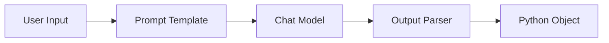
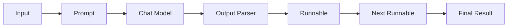
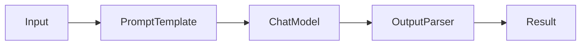
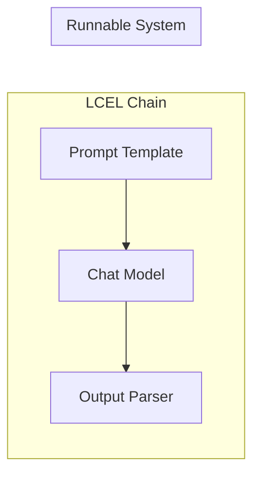

---

# 3.2 Core Concepts — Building Blocks

## Overview

Once you've learned how to send prompts to an LLM, the next challenge is answering questions like:

* How do I ensure the output is always JSON?
* How do I connect multiple AI steps?
* How do I combine LLMs with Python functions?
* How do I build reusable AI pipelines?

These are exactly the problems solved by:

| Component      | Purpose                                             |
| -------------- | --------------------------------------------------- |
| Output Parsers | Convert model output into a usable format           |
| Chains         | Connect multiple AI steps                           |
| Runnables      | Standard interface for all executable components    |
| LCEL           | Compose pipelines using a clean, declarative syntax |

---

## How They Fit Together



As applications become more sophisticated, these components are connected into pipelines:



---

# 1. Output Parsers

## Definition

An **Output Parser** converts the raw response from an LLM into a structured format that your application can reliably use.

Instead of treating the model's output as plain text, parsers transform it into:

* Python strings
* JSON
* Dictionaries
* Lists
* Pydantic models
* Other structured objects

---

## Why Output Parsers Exist

LLMs naturally generate free-form text, but applications often need structured data.

**Example without a parser:**

```text
Name: Alice
Age: 30
Department: Engineering
```

Your application must manually extract the fields.

**With a parser:**

```python
{
    "name": "Alice",
    "age": 30,
    "department": "Engineering"
}
```

This structure is much easier for code to process.

---

## Real-World Analogy

Think of a customs officer checking passports.

People arrive with information in different formats, but the officer standardizes it into a structured record.

An output parser performs the same role for AI responses.

---

## Common Output Parsers

| Parser                 | Output                 |
| ---------------------- | ---------------------- |
| `StrOutputParser`      | Plain string           |
| `JsonOutputParser`     | JSON object            |
| `PydanticOutputParser` | Validated Python model |
| Structured Output      | Schema-enforced object |

---

## StrOutputParser

### When to Use

Use it when you only need the generated text.

### Runnable Example

```bash
pip install -U langchain langchain-openai
```

```python
from langchain_openai import ChatOpenAI
from langchain_core.output_parsers import StrOutputParser
from langchain_core.prompts import PromptTemplate

prompt = PromptTemplate.from_template(
    "Explain {topic} in one sentence."
)

model = ChatOpenAI(
    model="gpt-4.1-mini",
    temperature=0
)

parser = StrOutputParser()

chain = prompt | model | parser

result = chain.invoke(
    {"topic": "LangChain"}
)

print(result)
```

### Expected Output

```text
LangChain is a framework for building applications powered by large language models.
```

---

## Why Use `StrOutputParser`?

Without it:

```python
response = model.invoke("Hello")

print(response)
```

Returns:

```python
AIMessage(
    content="Hello!"
)
```

With it:

```python
Hello!
```

---

## Advantages

* Very simple
* Removes message wrappers
* Perfect for text generation

---

## Limitations

* No validation
* No structure
* Cannot enforce schemas

---

## JSON Output

Sometimes your application expects:

```json
{
    "title": "...",
    "author": "...",
    "price": 100
}
```

instead of plain English.

Output parsers can guide the model toward this structured format and parse it into Python objects.

*(We'll cover `JsonOutputParser` and `PydanticOutputParser` in detail in the dedicated **Output Parsers** chapter.)*

---

## Best Practices

✅ Use `StrOutputParser` for plain text.

✅ Use structured parsers for APIs and automation.

⚠️ **Common Mistake:** Parsing JSON manually with string operations. Let the parser handle formatting and validation.

---

# 2. Chains

## Definition

A **Chain** connects multiple steps into a single workflow.

Instead of writing separate code for each stage, you combine them into one reusable pipeline.

---

## Why Chains Exist

Without a chain:

```python
prompt = ...
response = llm.invoke(prompt)
text = parser.invoke(response)
```

Every call requires repeating the same sequence.

With a chain:

```python
chain.invoke(data)
```

Everything runs automatically.

---

## Real-World Analogy

A car assembly line:

```text
Frame
   ↓
Engine
   ↓
Paint
   ↓
Inspection
   ↓
Finished Car
```

Each station performs one task.

A LangChain chain works the same way.

---

## Architecture


---

## Runnable Example

```python
from langchain_core.prompts import PromptTemplate
from langchain_openai import ChatOpenAI
from langchain_core.output_parsers import StrOutputParser

prompt = PromptTemplate.from_template(
    "Summarize {topic} in two sentences."
)

model = ChatOpenAI(
    model="gpt-4.1-mini",
    temperature=0
)

parser = StrOutputParser()

chain = prompt | model | parser

print(
    chain.invoke(
        {"topic": "Artificial Intelligence"}
    )
)
```

---

## Advantages

* Cleaner code
* Reusable
* Easy to extend
* Easier testing

---

## Limitations

* Complex workflows may require branching or loops, which are better handled by LangGraph.

---

## Best Practices

✅ Keep each chain focused on one responsibility.

✅ Compose small chains into larger workflows when needed.

⚠️ **Common Mistake:** Building one massive chain that is difficult to understand or debug.

---

# 3. Runnables

## Definition

A **Runnable** is any component that can be executed within LangChain.

Think of it as the universal interface for work.

---

## Why Runnables Exist

Prompt templates, models, parsers, and even Python functions all expose the same execution methods. This consistency lets you combine them seamlessly.

---

## Everything Is a Runnable

| Component                 | Runnable? |
| ------------------------- | --------- |
| PromptTemplate            | ✅         |
| Chat Model                | ✅         |
| Output Parser             | ✅         |
| Python Function (wrapped) | ✅         |
| Chain                     | ✅         |

---

## Standard Methods

| Method      | Purpose                  |
| ----------- | ------------------------ |
| `invoke()`  | Process a single input   |
| `batch()`   | Process multiple inputs  |
| `stream()`  | Yield incremental output |
| `ainvoke()` | Async execution          |

---

## Runnable Example

```python
from langchain_core.runnables import RunnableLambda

def square(x: int) -> int:
    return x * x

runnable = RunnableLambda(square)

print(runnable.invoke(5))
```

### Expected Output

```text
25
```

---

## Combining Runnables


Every stage follows the same interface, making pipelines easy to assemble.

---

## Advantages

* Uniform API
* Easy composition
* Supports sync, async, streaming, and batching

---

## Best Practices

✅ Prefer runnable composition over custom orchestration code.

⚠️ **Common Mistake:** Treating each component differently instead of relying on the shared Runnable interface.

---

# 4. LCEL (LangChain Expression Language)

## Definition

**LCEL** is LangChain's declarative syntax for connecting runnables into pipelines.

It uses the pipe (`|`) operator to pass the output of one runnable directly into the next.

---

## Why LCEL Exists

Before LCEL:

```python
prompt = template.invoke(data)
response = model.invoke(prompt)
result = parser.invoke(response)
```

With LCEL:

```python
chain = template | model | parser
```

The workflow is shorter, clearer, and easier to maintain.

---

## Real-World Analogy

Think of a factory conveyor belt.

Each machine performs one task, and the product moves automatically to the next station.

LCEL connects AI components in the same way.

---

## Architecture



---

## Runnable Example

```python
from langchain_core.prompts import PromptTemplate
from langchain_openai import ChatOpenAI
from langchain_core.output_parsers import StrOutputParser

prompt = PromptTemplate.from_template(
    "Give three facts about {topic}."
)

model = ChatOpenAI(
    model="gpt-4.1-mini",
    temperature=0
)

parser = StrOutputParser()

chain = prompt | model | parser

print(
    chain.invoke(
        {"topic": "Python"}
    )
)
```

---

## Why LCEL Is Important

Without LCEL:

* More boilerplate
* Manual orchestration
* Harder to extend

With LCEL:

* Concise
* Readable
* Composable
* Supports parallelism and branching with additional runnable constructs

---

## Best Practices

✅ Keep each runnable focused on a single responsibility.

✅ Build small LCEL pipelines and compose them into larger workflows.

⚠️ **Common Mistake:** Mixing business logic into prompt templates. Keep business logic in Python and use LCEL to connect components.

---

# Relationship Between the Four Concepts



* **Output Parser** transforms model output into a usable format.
* **Chain** represents a sequence of steps.
* **Runnable** is the common execution interface implemented by components like prompts, models, parsers, and chains.
* **LCEL** is the language used to compose runnables into pipelines.

---

# Choosing the Right Component

| Goal                                            | Use                            |
| ----------------------------------------------- | ------------------------------ |
| Return plain text                               | `StrOutputParser`              |
| Return structured data                          | JSON or Pydantic output parser |
| Connect multiple AI steps                       | Chain                          |
| Build reusable pipelines                        | LCEL                           |
| Execute prompts, models, or functions uniformly | Runnable                       |

---

# Key Takeaways

* **Output Parsers** convert LLM responses into formats your application can reliably consume.
* **Chains** organize multiple processing steps into reusable workflows.
* **Runnables** provide a consistent execution interface (`invoke`, `batch`, `stream`, `ainvoke`) across LangChain components.
* **LCEL** is the preferred modern way to build LangChain pipelines by composing runnables with the `|` operator.

These concepts are the foundation of modern LangChain development. Once you understand them, you're ready to explore more advanced capabilities such as **Memory, Tools, and Agents**, where applications begin to maintain context, interact with external systems, and make decisions dynamically.
