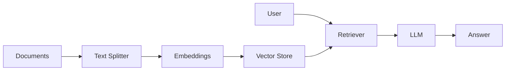
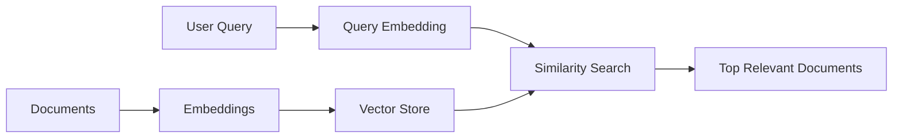
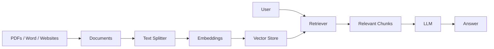

Excellent. This is the chapter where you'll understand **why RAG has become one of the most important patterns in Generative AI**.

Up to this point, we've focused on getting an LLM to generate responses. Now we'll teach it to answer questions using **your own documents**—whether they're PDFs, Word files, websites, company policies, or databases.

---

# 3.4 Core Concepts — RAG Foundation

## Overview

Before learning how to build a complete RAG application, you need to understand the four core building blocks:

1. **Documents** – The knowledge source
2. **Embeddings** – Convert text into numerical vectors
3. **Vector Stores** – Store and search embeddings efficiently
4. **Retrievers** – Find the most relevant information

Together, these components enable Retrieval-Augmented Generation (RAG).

---

## How They Work Together



---

# Why Do We Need RAG?

Suppose you ask ChatGPT:

> "What is our company's leave policy?"

The model may not know because:

* It was trained before your policy existed.
* It has never seen your internal documents.
* It cannot access your files automatically.

RAG solves this by **retrieving relevant information from your documents before generating an answer**.

---

## Traditional LLM vs RAG

| Traditional LLM                          | RAG                                   |
| ---------------------------------------- | ------------------------------------- |
| Uses training knowledge                  | Uses your documents                   |
| Knowledge may be outdated                | Always retrieves latest documents     |
| Can hallucinate                          | Grounded in retrieved context         |
| Cannot answer company-specific questions | Excellent for private knowledge bases |

---

# 1. Documents

## Definition

A **Document** is the fundamental unit of information in LangChain.

It contains:

* The text (called `page_content`)
* Metadata (information about the source)

Think of a document as a structured container rather than just plain text.

---

## Real-World Analogy

Imagine a library.

Every book contains:

* The content
* The title
* The author
* The publication year
* The shelf number

Similarly, a LangChain `Document` stores the content along with useful metadata.

---

## Document Structure

```python
from langchain_core.documents import Document

doc = Document(
    page_content="""
    LangChain is a framework for building LLM applications.
    """,
    metadata={
        "source": "langchain_notes.pdf",
        "page": 5,
        "author": "Raj"
    }
)

print(doc.page_content)
print(doc.metadata)
```

### Expected Output

```python
LangChain is a framework for building LLM applications.

{
    'source': 'langchain_notes.pdf',
    'page': 5,
    'author': 'Raj'
}
```

---

## Why Metadata Matters

Metadata helps:

* Filter documents
* Track sources
* Display citations
* Restrict search

Example:

```python
metadata = {
    "department": "HR",
    "year": 2026,
    "language": "English"
}
```

You can later retrieve only HR documents.

---

## Supported Document Sources

| Source   | Loader         |
| -------- | -------------- |
| PDF      | PyPDFLoader    |
| Word     | Docx2txtLoader |
| CSV      | CSVLoader      |
| HTML     | BSHTMLLoader   |
| Markdown | TextLoader     |
| Website  | WebBaseLoader  |
| JSON     | JSONLoader     |

*(We'll explore these in the Document Loaders chapter.)*

---

## Advantages

* Standardized representation
* Includes metadata
* Works with all LangChain components

---

## Common Mistakes

❌ Treating documents as plain strings.

❌ Ignoring metadata.

❌ Storing extremely large documents without splitting.

---

# 2. Embeddings

## Definition

An **embedding** is a numerical representation of text that captures its semantic meaning.

Instead of storing text as words, embeddings represent it as vectors in a high-dimensional space.

---

## Why Embeddings Exist

Computers don't inherently understand language.

For example:

```
Car
Automobile
Vehicle
```

Humans know these words are related.

Embeddings place them close together in vector space, allowing the computer to recognize their similarity.

---

## Real-World Analogy

Imagine a map of cities.

Cities that are geographically close are easier to travel between.

Embeddings create a similar "map" of meaning, where semantically similar texts are located near each other.

---

## Text → Vector

```
Text

"LangChain is awesome."

↓

Embedding Model

↓

[0.12, -0.45, 0.88, ...]
```

A vector might contain hundreds or thousands of dimensions, depending on the model.

---

## Why Not Use Keywords?

Traditional search:

```
Car
```

may not find:

```
Automobile
```

Embedding search understands semantic similarity, not just exact word matches.

---

## Embedding Workflow


---

## Runnable Example

```bash
pip install -U langchain-openai
```

```python
from langchain_openai import OpenAIEmbeddings

embeddings = OpenAIEmbeddings(
    model="text-embedding-3-small"
)

vector = embeddings.embed_query(
    "What is LangChain?"
)

print(len(vector))
```

### Expected Output

```text
1536
```

*(The exact dimensionality depends on the embedding model.)*

---

## Where Are Embeddings Used?

* RAG
* Semantic search
* Recommendation systems
* Duplicate detection
* Clustering
* Similarity search

---

## Advantages

* Captures meaning
* Handles synonyms
* Improves retrieval quality
* Language-aware

---

## Limitations

* Computational cost
* Storage requirements
* Model-dependent quality
* Need re-indexing if the embedding model changes

---

## Best Practices

✅ Use one embedding model consistently within a vector store.

✅ Recompute embeddings if you switch models.

---

## Common Mistakes

❌ Mixing embeddings from different models.

❌ Recomputing embeddings unnecessarily.

---

# 3. Vector Stores

## Definition

A **Vector Store** is a specialized database designed to store embeddings and retrieve the most similar ones efficiently.

---

## Why Vector Stores Exist

Imagine storing one million document embeddings.

To answer a question, you'd have to compare the query embedding with every stored embedding.

That's computationally expensive.

Vector databases use specialized indexing algorithms (such as Approximate Nearest Neighbor search) to find similar vectors quickly.

---

## Real-World Analogy

Think of a library.

Instead of reading every book to answer a question, the librarian quickly finds the most relevant books using a catalog.

A vector store acts as that intelligent catalog.

---

## Architecture



---

## Common Vector Stores

| Vector Store | Type              | Best For                    |
| ------------ | ----------------- | --------------------------- |
| FAISS        | Local             | Development                 |
| Chroma       | Local             | Small to medium projects    |
| Pinecone     | Cloud             | Production                  |
| Weaviate     | Cloud/Self-hosted | Enterprise                  |
| Qdrant       | Cloud/Self-hosted | High-performance production |

---

## Runnable Example (Chroma)

```bash
pip install -U chromadb langchain-chroma
```

```python
from langchain_chroma import Chroma
from langchain_openai import OpenAIEmbeddings

embeddings = OpenAIEmbeddings()

vector_db = Chroma(
    collection_name="langchain_docs",
    embedding_function=embeddings
)
```

---

## Advantages

* Fast similarity search
* Scales to millions of vectors
* Supports metadata filtering
* Designed for semantic retrieval

---

## Common Mistakes

❌ Using a relational database for vector search.

❌ Forgetting to persist the database.

---

# 4. Retrievers

## Definition

A **Retriever** is the component that finds the most relevant documents from a vector store based on a user's query.

It is the bridge between stored knowledge and the LLM.

---

## Why Retrievers Exist

The LLM cannot read millions of documents.

Instead, the retriever selects only the most relevant ones.

---

## Architecture


---

## Runnable Example

```python
retriever = vector_db.as_retriever(
    search_kwargs={"k": 3}
)

docs = retriever.invoke(
    "What is LangChain?"
)

for doc in docs:
    print(doc.page_content)
```

### Expected Output

```text
LangChain is a framework...
```

The retriever returns the three most relevant documents.

---

## Retrieval Strategies

| Strategy                     | Description                                            |
| ---------------------------- | ------------------------------------------------------ |
| Similarity Search            | Finds closest embeddings                               |
| MMR (Max Marginal Relevance) | Balances relevance and diversity                       |
| Hybrid Search                | Combines keyword and semantic search                   |
| Multi-Query Retrieval        | Generates multiple query variations                    |
| Context Compression          | Filters retrieved content before sending it to the LLM |

*(We'll cover these in depth in the Retrievers chapter.)*

---

## Advantages

* Efficient
* Scalable
* Reduces hallucinations
* Provides context-aware answers

---

## Common Mistakes

❌ Retrieving too many documents, leading to unnecessary token usage.

❌ Retrieving too few documents, causing missing context.

---

# How Everything Connects



---

# Component Comparison

| Component    | Purpose                     | Input      | Output              |
| ------------ | --------------------------- | ---------- | ------------------- |
| Document     | Stores content and metadata | Raw data   | Structured document |
| Embedding    | Converts text to vectors    | Text       | Numerical vector    |
| Vector Store | Stores and indexes vectors  | Embeddings | Searchable index    |
| Retriever    | Finds relevant information  | Query      | Relevant documents  |

---

# Interview Questions

### Q1. Why are embeddings needed?

Embeddings transform text into numerical vectors so that semantic similarity can be measured efficiently.

---

### Q2. What is the difference between a vector store and a retriever?

A vector store **stores and indexes** embeddings, while a retriever **queries** the vector store to return the most relevant documents.

---

### Q3. Why is metadata important in documents?

Metadata enables filtering, traceability, citations, and more targeted retrieval.

---

### Q4. Can you change the embedding model after indexing?

Yes, but you must **recompute all embeddings** and rebuild the vector index. Mixing embeddings from different models in the same index generally leads to poor retrieval quality.

---

# What You've Learned

You now understand the four foundational components of every RAG system:

* **Documents** organize content and metadata.
* **Embeddings** convert text into semantic vectors.
* **Vector Stores** index and store embeddings for efficient search.
* **Retrievers** locate the most relevant information to provide the LLM with accurate context.

These components work together to let an LLM answer questions grounded in **your own data** rather than relying solely on its pre-trained knowledge.

In the next chapter, we'll bring all of these pieces together to build a **complete end-to-end Retrieval-Augmented Generation (RAG) application** using modern LangChain, covering document loading, chunking, embedding, indexing, retrieval, answer generation, optimization, and evaluation.
