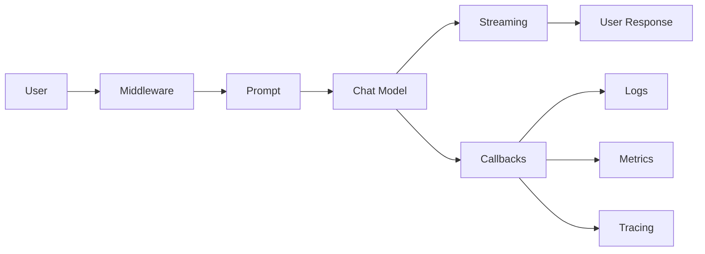
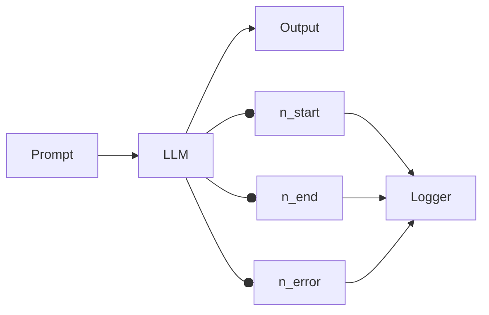
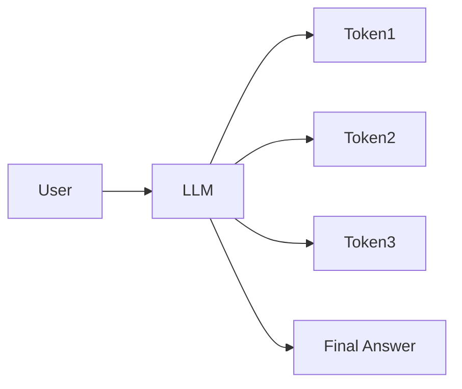
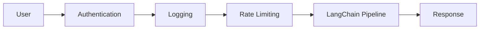
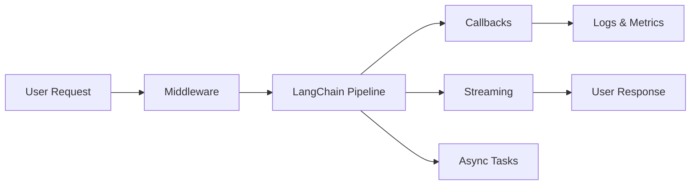

# 3.5 Core Concepts — Production Features

* **Callbacks**
* **Streaming**
* **Async**
* **Middleware**

These are the features that make LangChain applications **observable, responsive, scalable, and production-ready**.

---

# Overview

Building an AI application involves more than generating responses. In production, you often need to:

* Monitor what the model is doing
* Stream responses to users as they're generated
* Handle many requests concurrently
* Apply cross-cutting logic like authentication, logging, or retries

These needs are addressed by the following production features:

| Component      | Purpose                                                        |
| -------------- | -------------------------------------------------------------- |
| **Callbacks**  | Observe and react to LangChain events                          |
| **Streaming**  | Return output incrementally as it's generated                  |
| **Async**      | Handle multiple tasks efficiently without blocking             |
| **Middleware** | Intercept and modify requests/responses across the application |

---

# Production Architecture



---

# 1. Callbacks

## Definition

**Callbacks** are event hooks that let you observe and respond to what happens inside a LangChain application.

They can be triggered when:

* An LLM starts processing
* A token is generated
* A chain begins or ends
* A tool is invoked
* An error occurs

Rather than changing your business logic, callbacks let you **watch and react** to execution.

---

## Why Callbacks Exist

Imagine debugging an AI application without knowing:

* Which prompt was sent
* How long the model took
* Which tool was called
* Whether an error occurred

Callbacks provide this visibility.

---

## Real-World Analogy

Think of airport security cameras.

They don't change how passengers travel, but they record everything for monitoring and troubleshooting.

Callbacks play the same role for LangChain applications.

---

## Common Callback Events

| Event                 | Trigger                  |
| --------------------- | ------------------------ |
| `on_llm_start`        | Model begins processing  |
| `on_llm_end`          | Model completes          |
| `on_chat_model_start` | Chat model starts        |
| `on_chain_start`      | Chain execution begins   |
| `on_chain_end`        | Chain finishes           |
| `on_tool_start`       | Tool execution begins    |
| `on_tool_end`         | Tool execution completes |
| `on_llm_error`        | Model execution fails    |

---

## Execution Flow



---

## Runnable Example

```python
from langchain_openai import ChatOpenAI

model = ChatOpenAI(
    model="gpt-4.1-mini"
)

response = model.invoke(
    "Explain LangChain."
)

print(response.content)
```

In production, callback handlers (or tracing tools such as LangSmith) can record:

* Prompt
* Response
* Execution time
* Token usage
* Errors

without modifying your application logic.

---

## Advantages

* Debugging
* Monitoring
* Performance metrics
* Token tracking
* Auditing

---

## Limitations

* Excessive logging can affect performance.
* Logging prompts may expose sensitive data if not handled carefully.

---

## Best Practices

✅ Use callbacks for logging and monitoring.

✅ Record latency and token usage.

✅ Mask or redact sensitive information before logging.

⚠️ **Common Mistake:** Logging API keys, passwords, or personally identifiable information.

---

# 2. Streaming

## Definition

**Streaming** allows the model to send tokens incrementally instead of waiting for the complete response.

---

## Why Streaming Exists

Without streaming:

```
User waits...
User waits...
User waits...

Entire answer appears.
```

With streaming:

```
The...
The capital...
The capital of...
The capital of France...
```

The user sees progress immediately.

---

## Real-World Analogy

Streaming is like watching a live sports broadcast rather than waiting for the entire game to finish before seeing the result.

---

## Architecture



---

## Runnable Example

```python
from langchain_openai import ChatOpenAI

model = ChatOpenAI(
    model="gpt-4.1-mini"
)

for chunk in model.stream(
    "Explain recursion."
):
    print(chunk.content, end="")
```

---

## Expected Output

```
Recursion is...
a programming...
technique where...
```

Tokens appear progressively.

---

## Advantages

* Better user experience
* Lower perceived latency
* Ideal for chat applications

---

## Limitations

* Slightly more complex UI handling
* Requires stream-aware clients

---

## Best Practices

✅ Stream long responses.

✅ Display tokens immediately in chat interfaces.

⚠️ **Common Mistake:** Waiting until the stream finishes before updating the UI, which defeats the purpose of streaming.

---

# 3. Async Programming

## Definition

**Async programming** lets your application perform multiple operations concurrently without blocking execution.

---

## Why Async Exists

Suppose your application:

* Calls an LLM
* Reads a database
* Calls a weather API

If each task waits for the previous one, users experience unnecessary delays.

Async allows independent tasks to overlap.

---

## Real-World Analogy

Imagine a chef preparing a meal.

Instead of:

1. Boil water
2. Wait
3. Chop vegetables
4. Wait
5. Cook rice

The chef starts boiling water while chopping vegetables, making better use of time.

---

## Synchronous vs Asynchronous

### Synchronous

```
Task 1

↓

Task 2

↓

Task 3
```

### Asynchronous

```
Task 1 ───────┐
Task 2 ───────┼──► Finish
Task 3 ───────┘
```

---

## Runnable Example

```python
import asyncio

from langchain_openai import ChatOpenAI

model = ChatOpenAI(
    model="gpt-4.1-mini"
)

async def ask():
    response = await model.ainvoke(
        "Explain Python generators."
    )
    print(response.content)

asyncio.run(ask())
```

---

## Advantages

* Higher throughput
* Better scalability
* Improved responsiveness
* Efficient I/O utilization

---

## Limitations

* Increased code complexity
* Requires familiarity with `async`/`await`
* Mixing synchronous and asynchronous code incorrectly can cause issues

---

## Best Practices

✅ Use `ainvoke()` for concurrent requests.

✅ Use `asyncio.gather()` to execute independent tasks in parallel.

⚠️ **Common Mistake:** Calling blocking functions inside asynchronous code, which negates the benefits of async execution.

---

# 4. Middleware

## Definition

**Middleware** is a layer that intercepts requests and responses to apply common logic before or after your LangChain workflow executes.

It helps centralize concerns that apply across the application.

---

## Why Middleware Exists

Many operations should happen for **every** request:

* Authentication
* Authorization
* Logging
* Rate limiting
* Request validation
* Retry policies

Instead of duplicating this logic everywhere, middleware handles it in one place.

---

## Real-World Analogy

Think of airport security.

Every passenger goes through security before boarding a plane.

The security process is independent of the destination, just as middleware is independent of the specific AI task.

---

## Architecture



---

## Example Workflow

```
Incoming Request

↓

Authenticate User

↓

Log Request

↓

Run LangChain

↓

Log Response

↓

Return Output
```

---

## Common Middleware Responsibilities

| Responsibility | Purpose                         |
| -------------- | ------------------------------- |
| Authentication | Verify user identity            |
| Authorization  | Check permissions               |
| Logging        | Record request/response details |
| Rate Limiting  | Prevent abuse                   |
| Retry Logic    | Recover from transient failures |
| Caching        | Improve performance             |

---

## Advantages

* Centralized logic
* Cleaner application code
* Easier maintenance
* Consistent behavior across requests

---

## Limitations

* Adds another processing layer
* Poorly designed middleware can become a performance bottleneck

---

## Best Practices

✅ Keep middleware focused on cross-cutting concerns.

✅ Log enough information for troubleshooting without exposing sensitive data.

⚠️ **Common Mistake:** Embedding business logic inside middleware. Business logic belongs in your application or chains, not in the middleware layer.

---

# How These Production Features Work Together



---

# Feature Comparison

| Feature        | Primary Purpose                | Typical Use                      |
| -------------- | ------------------------------ | -------------------------------- |
| **Callbacks**  | Observe execution              | Logging, tracing, monitoring     |
| **Streaming**  | Incremental output             | Chatbots, live UIs               |
| **Async**      | Concurrent execution           | High-throughput services         |
| **Middleware** | Cross-cutting request handling | Authentication, logging, retries |

---

# Interview Questions

### Q1. What is the purpose of callbacks in LangChain?

Callbacks provide hooks into the execution lifecycle, enabling logging, monitoring, debugging, token tracking, and tracing without changing business logic.

---

### Q2. Why use streaming instead of waiting for the full response?

Streaming reduces perceived latency by showing output as it's generated, improving the user experience in interactive applications.

---

### Q3. When should you use asynchronous execution?

Use async when tasks involve waiting for I/O (such as LLM calls, databases, or APIs) and can run concurrently.

---

### Q4. What belongs in middleware?

Cross-cutting concerns such as authentication, authorization, logging, rate limiting, retries, and request validation belong in middleware.

---

# Summary

With this chapter, you've completed the **Core Concepts** of LangChain.

You now understand:

* **LLMs** and **Chat Models** for generating responses
* **Prompts**, **Prompt Templates**, and **Messages** for interacting with models
* **Output Parsers**, **Chains**, **Runnables**, and **LCEL** for building AI pipelines
* **Memory**, **Tools**, and **Agents** for intelligent, stateful applications
* **Documents**, **Embeddings**, **Vector Stores**, and **Retrievers** for RAG
* **Callbacks**, **Streaming**, **Async**, and **Middleware** for production-ready systems

These concepts form the foundation for everything else in LangChain. The next chapter, **LangChain Architecture**, will show how these components interact in a complete request lifecycle, giving you a clear mental model of how a modern LangChain application works end to end.
