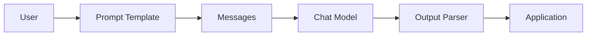
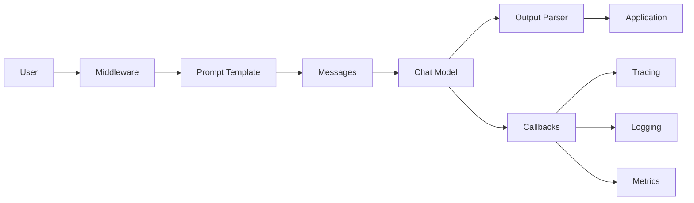
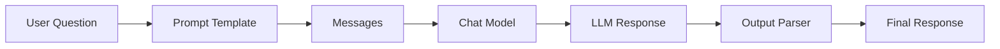
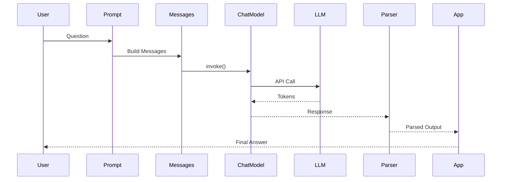
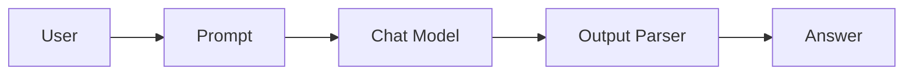
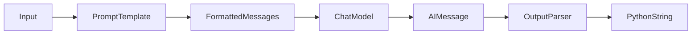
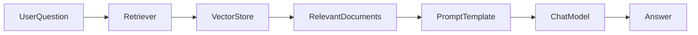

# 4. LangChain Architecture

> **Learning Goal**
>
> After completing this chapter, you will understand:
>
> * How LangChain processes a request from start to finish
> * How every component communicates with others
> * The internal execution flow
> * How LCEL executes pipelines
> * Where Prompt Templates, Models, Parsers, Tools, Memory, and Runnables fit
> * How to debug execution
> * Modern LangChain architecture (v1.x)

---

# What is LangChain Architecture?

Think of LangChain like a **restaurant**.

A customer walks in...

Instead of directly cooking food, many people work together.

```
Customer
   │
Waiter
   │
Kitchen Manager
   │
Chef
   │
Food Quality Check
   │
Serve Food
```

LangChain works similarly.

```
User
   │
Prompt
   │
LLM
   │
Output Parser
   │
Application
```

Instead of one huge AI call, LangChain builds a **pipeline**.

Every component has a responsibility.

---

# High-Level Architecture



---

# Main Components

| Component       | Responsibility          |
| --------------- | ----------------------- |
| User            | Sends request           |
| Prompt Template | Creates prompt          |
| Messages        | Structures conversation |
| Chat Model      | Calls LLM               |
| Output Parser   | Converts response       |
| Application     | Displays result         |

---

# Bigger Picture

A production application has more moving parts.



---

# Component Responsibilities

## 1. User

The process always begins here.

Example:

```
"What is LangChain?"
```

---

## 2. Prompt Template

Transforms raw user input into a high-quality prompt.

Example

Instead of sending

```
What is LangChain?
```

we send

```
You are an AI tutor.

Explain LangChain to beginners.

Question:
What is LangChain?
```

The LLM performs significantly better with structured prompts.

---

## 3. Messages

Chat models expect structured messages.

```
System Message

↓

Human Message

↓

AI Message

↓

Tool Message
```

---

## 4. Chat Model

This is the actual LLM.

Examples

* OpenAI GPT-4.1
* GPT-4o
* Claude
* Gemini
* Ollama
* Mistral

Its only responsibility is:

```
Input

↓

Generate tokens

↓

Return response
```

---

## 5. Output Parser

LLMs return text.

Applications usually need:

* JSON
* Lists
* Python objects
* Structured data

Parser converts text into usable objects.

---

## 6. Application

Finally, your application displays:

* chatbot response
* website
* API
* mobile app
* Slack bot
* Teams bot

---

# Complete Request Lifecycle

Imagine asking:

```
Explain Vector Databases.
```

Execution becomes



---

# Step-by-Step Execution

## Step 1

User types

```
Explain Vector Databases.
```

---

## Step 2

Prompt Template creates

```
You are an expert AI teacher.

Answer in simple language.

Question:
Explain Vector Databases.
```

---

## Step 3

Messages become

```python
[
 SystemMessage(...),
 HumanMessage(...)
]
```

---

## Step 4

Chat Model sends API request

```
POST

↓

LLM Provider

↓

Inference

↓

Generated Tokens
```

---

## Step 5

Response returns

```
Vector databases store embeddings...
```

---

## Step 6

Parser converts response.

Example

```
String

↓

JSON

↓

Python Dictionary
```

---

## Step 7

Application displays

```
Answer shown to user.
```

---

# Internal Component Interaction



---

# LCEL Execution Flow

Modern LangChain uses **LCEL (LangChain Expression Language)** to compose components.

A simple pipeline looks like this:



In code:

```python
chain = prompt | model | parser
```

Each stage passes its output to the next stage.

---

# Modern Runnable Example (Latest LangChain)

## Prerequisites

* Python 3.10+
* An API key for your chosen provider (OpenAI shown below)

## Installation

```bash
pip install -U langchain langchain-openai
```

Set your API key:

**Linux/macOS**

```bash
export OPENAI_API_KEY="your_api_key_here"
```

**Windows PowerShell**

```powershell
$env:OPENAI_API_KEY="your_api_key_here"
```

## Code

```python
# Import the prompt template
from langchain_core.prompts import ChatPromptTemplate

# Import the chat model
from langchain_openai import ChatOpenAI

# Import a parser that returns plain text
from langchain_core.output_parsers import StrOutputParser

# Create a prompt template with one variable
prompt = ChatPromptTemplate.from_template(
    "Explain {topic} in simple terms."
)

# Initialize the chat model
model = ChatOpenAI(
    model="gpt-4.1",   # Replace with a model available to your account
    temperature=0
)

# Parse the AI message into a string
parser = StrOutputParser()

# Build the chain using LCEL
chain = prompt | model | parser

# Execute the chain
response = chain.invoke({"topic": "LangChain"})

# Print the result
print(response)
```

### What happens internally?

1. `ChatPromptTemplate` formats the prompt with `topic="LangChain"`.
2. The formatted messages are passed to `ChatOpenAI`.
3. The model sends a request to the provider.
4. The AI response is returned as an `AIMessage`.
5. `StrOutputParser` extracts the text content.
6. The final string is printed.

### Expected Output

```text
LangChain is a framework for building applications powered by large language models. It helps you combine prompts, models, tools, and other components into reusable workflows...
```

---

# Under the Hood



---

# Request Lifecycle in a RAG Application

Real-world applications often include retrieval before generation.



Flow:

1. User asks a question.
2. Retriever searches the vector database.
3. Relevant documents are returned.
4. Prompt combines user question and retrieved context.
5. LLM generates an informed answer.
6. Application returns the final response.

---

# Where Other LangChain Components Fit

| Component          | Role in Architecture                                       |
| ------------------ | ---------------------------------------------------------- |
| Prompt Template    | Creates high-quality prompts                               |
| Messages           | Structures conversations                                   |
| Chat Model         | Generates responses                                        |
| Output Parser      | Converts model output                                      |
| Runnable           | Standard execution interface (`invoke`, `batch`, `stream`) |
| LCEL               | Connects components into pipelines                         |
| Retriever          | Finds relevant documents                                   |
| Vector Store       | Stores embeddings                                          |
| Embeddings         | Convert text into vectors                                  |
| Tools              | Enable external actions (search, APIs, calculators)        |
| Agents             | Decide which tools to use                                  |
| Memory (when used) | Supplies conversational context                            |

---

# Flow of Execution

```text
User Input
    │
    ▼
Prompt Formatting
    │
    ▼
Message Creation
    │
    ▼
Model Invocation
    │
    ▼
Response Generation
    │
    ▼
Output Parsing
    │
    ▼
Application Response
```

---

# Common Errors and Fixes

| Error                  | Cause                      | Fix                                             |
| ---------------------- | -------------------------- | ----------------------------------------------- |
| `ModuleNotFoundError`  | Package not installed      | Run `pip install -U langchain langchain-openai` |
| Authentication error   | Missing or invalid API key | Set `OPENAI_API_KEY` correctly                  |
| `invoke()` input error | Wrong input type           | Pass a dictionary matching prompt variables     |
| Model not found        | Incorrect model name       | Use a model available to your provider/account  |
| Rate limit exceeded    | Too many requests          | Retry with backoff or reduce request frequency  |

---

> 💡 **Tips**
>
> * Think of LangChain as a **pipeline builder**, not an LLM.
> * Each component should have a single responsibility.
> * Understanding the request lifecycle makes debugging much easier.
> * Use LCEL (`|`) to compose readable, reusable workflows.

---

> ⚠️ **Common Mistakes**
>
> * Calling the model directly everywhere instead of creating reusable chains.
> * Forgetting to provide all variables required by a prompt template.
> * Parsing structured output with a plain string parser.
> * Using deprecated APIs (`LLMChain`, `run()`, etc.) instead of modern `Runnable` interfaces like `invoke()`.

---

> ✅ **Best Practices**
>
> * Prefer LCEL pipelines (`prompt | model | parser`) for new projects.
> * Keep prompts, models, and parsers modular and reusable.
> * Separate business logic from prompt definitions.
> * Add logging and callbacks for observability in production.
> * Test each component independently before combining them.

---

> 🚀 **Pro Tips**
>
> * Treat every LangChain application as a data flow: **Input → Transform → Generate → Parse → Output**.
> * Design chains as small, composable building blocks rather than one large pipeline.
> * As applications grow, introduce retrievers, tools, middleware, and agents incrementally instead of all at once.
> * Master the architecture first—advanced topics like RAG, agents, LangGraph, and multi-agent systems become much easier once you understand this execution model.

---

# Chapter Summary

In this chapter, you learned:

* The overall architecture of LangChain
* The responsibilities of each core component
* The complete request lifecycle from user input to final output
* How components interact internally
* How LCEL composes modern pipelines
* Where retrievers, vector stores, tools, and agents fit into the architecture
* A fully runnable example using the latest LangChain APIs
* Common pitfalls, best practices, and practical debugging guidance

This architectural foundation is essential for understanding the more advanced LangChain topics that follow, including **Runnables**, **LCEL**, **Retrieval-Augmented Generation (RAG)**, **Tools**, **Agents**, and **LangGraph**.
