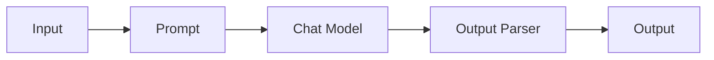
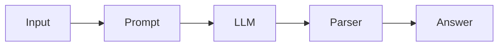
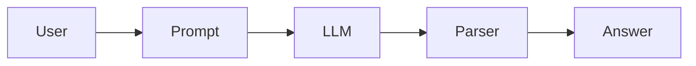
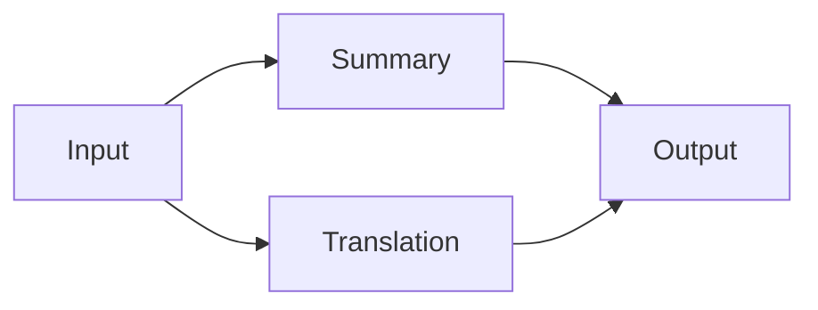
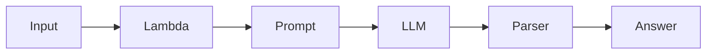
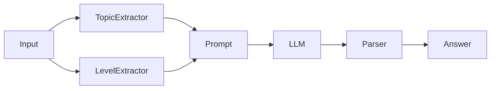
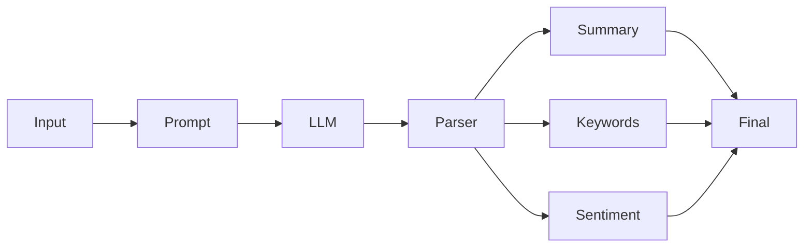

# Lesson 5: LangChain Expression Language (LCEL)

> **LangChain Version:** Latest (v0.3+/v1 APIs)
>
> This chapter explains the **LangChain Expression Language (LCEL)**, the modern way to build LangChain applications.

---

# What is LCEL?

Before LCEL, building a LangChain application meant creating multiple chain objects and connecting them manually.

Example:

```
Prompt
   ↓
LLM
   ↓
Parser
```

Every step had to be managed separately.

LCEL introduces a much cleaner approach.

Instead of manually connecting components, every component becomes a **Runnable**, and Runnables can be connected together using a simple pipe (`|`) operator.

Think of it like Unix pipes:

```
command1 | command2 | command3
```

LCEL works similarly:

```
Prompt | LLM | Parser
```

Everything is connected automatically.

---

# Why LCEL?

Imagine a factory.

Without LCEL:

```
Worker A
↓

Worker B
↓

Worker C
```

You manually hand the item from one worker to another.

With LCEL:

```
Conveyor Belt

Worker A → Worker B → Worker C
```

The conveyor belt automatically moves everything.

LCEL is that conveyor belt.

---

# Benefits of LCEL

| Feature            | Benefit                              |
| ------------------ | ------------------------------------ |
| Declarative        | Focus on what happens instead of how |
| Streaming          | Built-in                             |
| Async              | Built-in                             |
| Batch processing   | Built-in                             |
| Parallel execution | Built-in                             |
| Retry support      | Built-in                             |
| Type safety        | Better validation                    |
| Reusability        | Easy composition                     |
| Debugging          | Easier tracing                       |

---

# Everything is a Runnable

In modern LangChain:

* PromptTemplate
* ChatPromptTemplate
* Chat Models
* Output Parsers
* Lambdas
* Custom Functions

are all **Runnable** objects.

Because they are all Runnable, they can be chained together.

---

# Basic LCEL Flow



---

# Installation

```bash
pip install -U langchain langchain-core langchain-openai
```

For Ollama:

```bash
pip install -U langchain-ollama
```

---

# Example Setup

```python
from langchain_core.prompts import ChatPromptTemplate
from langchain_ollama import ChatOllama
from langchain_core.output_parsers import StrOutputParser

llm = ChatOllama(
    model="llama3.2:3b"
)

prompt = ChatPromptTemplate.from_template(
    "Explain {topic} in simple words."
)

parser = StrOutputParser()
```

---

# The Pipe Operator (`|`)

This is the most important operator in LCEL.

Instead of:

```python
prompt_value = prompt.invoke({"topic":"AI"})
response = llm.invoke(prompt_value)
answer = parser.invoke(response)
```

We simply write:

```python
chain = prompt | llm | parser
```

That's it.

---

## Execution Flow



---

# RunnableSequence

RunnableSequence executes components one after another.

```
Input

↓

Step 1

↓

Step 2

↓

Step 3

↓

Output
```

---

## Example

```python
# Install:
# pip install -U langchain langchain-core langchain-ollama

from langchain_core.prompts import ChatPromptTemplate
from langchain_core.output_parsers import StrOutputParser
from langchain_ollama import ChatOllama

# Load the LLM
llm = ChatOllama(model="llama3.2:3b")

# Create a prompt template
prompt = ChatPromptTemplate.from_template(
    "Explain {topic} like I'm 10 years old."
)

# Convert AIMessage -> string
parser = StrOutputParser()

# Create the sequence
chain = prompt | llm | parser

# Execute the chain
result = chain.invoke(
    {"topic": "Neural Networks"}
)

print(result)
```

---

### Execution Order

```
Input

↓

Prompt

↓

ChatPromptValue

↓

LLM

↓

AIMessage

↓

Parser

↓

String
```

---

Expected Output

```
Neural networks are computer programs inspired by the human brain...
```

---

## Equivalent Without LCEL

```python
prompt_value = prompt.invoke(
    {"topic":"Neural Networks"}
)

response = llm.invoke(prompt_value)

result = parser.invoke(response)

print(result)
```

LCEL simply automates these steps.

---

# RunnableSequence Diagram



---

# RunnableParallel

Sometimes tasks are independent.

Instead of

```
Question

↓

Summary

↓

Translation

↓

Sentiment
```

we can execute all together.

```
Summary
         \
Question --- Translation
         /
Sentiment
```

---

RunnableParallel executes multiple runnables simultaneously.

---

## Example

```python
from langchain_core.runnables import RunnableParallel
from langchain_core.prompts import ChatPromptTemplate
from langchain_core.output_parsers import StrOutputParser
from langchain_ollama import ChatOllama

llm = ChatOllama(model="llama3.2:3b")

parser = StrOutputParser()

summary_chain = (
    ChatPromptTemplate.from_template(
        "Summarize:\n{text}"
    )
    | llm
    | parser
)

translation_chain = (
    ChatPromptTemplate.from_template(
        "Translate to French:\n{text}"
    )
    | llm
    | parser
)

parallel = RunnableParallel(
    summary=summary_chain,
    translation=translation_chain
)

result = parallel.invoke(
    {
        "text":"LangChain simplifies LLM application development."
    }
)

print(result)
```

---

Expected Output

```python
{
    'summary':'...',
    'translation':'...'
}
```

---

# RunnableParallel Flow



---

# RunnableLambda

RunnableLambda converts a normal Python function into a Runnable.

Suppose we want to clean user input before sending it to the LLM.

Instead of modifying the chain manually, we create a RunnableLambda.

---

## Example

```python
from langchain_core.runnables import RunnableLambda

def clean_text(text: str):
    # Remove leading/trailing whitespace
    return text.strip().lower()

cleaner = RunnableLambda(clean_text)

print(cleaner.invoke("   HELLO WORLD   "))
```

Expected Output

```
hello world
```

---

Now integrate it into an LCEL chain.

```python
from langchain_core.prompts import ChatPromptTemplate
from langchain_core.output_parsers import StrOutputParser
from langchain_ollama import ChatOllama
from langchain_core.runnables import RunnableLambda

llm = ChatOllama(model="llama3.2:3b")
parser = StrOutputParser()

# Step 1: Clean incoming dictionary
clean = RunnableLambda(
    lambda x: {
        "topic": x["topic"].strip().title()
    }
)

prompt = ChatPromptTemplate.from_template(
    "Explain {topic}."
)

chain = (
    clean
    | prompt
    | llm
    | parser
)

print(chain.invoke(
    {"topic":"   langchain "}
))
```

---

# RunnableLambda Flow



---

# RunnableMap

`RunnableMap` applies multiple runnables to the same input and returns a dictionary of results. In current LangChain, using a Python dictionary in an LCEL chain is the most common pattern, and it behaves like a runnable map.

## Why use it?

Suppose an LLM needs both:

* the original question
* the current timestamp
* a cleaned version of the question

Instead of preprocessing manually, you can build a mapping.

---

## Example

```python
from datetime import datetime
from langchain_core.runnables import RunnableLambda

mapping = {
    "question": RunnableLambda(lambda x: x["question"]),
    "clean_question": RunnableLambda(
        lambda x: x["question"].strip().lower()
    ),
    "timestamp": RunnableLambda(
        lambda _: datetime.now().isoformat()
    ),
}

result = mapping.invoke({"question": "  What is LCEL?  "})

print(result)
```

Expected Output

```python
{
    "question": "  What is LCEL?  ",
    "clean_question": "what is lcel?",
    "timestamp": "2026-07-25T10:15:30.123456"
}
```

---

## Using RunnableMap with an LLM

```python
from langchain_core.prompts import ChatPromptTemplate
from langchain_core.output_parsers import StrOutputParser
from langchain_core.runnables import RunnableLambda
from langchain_ollama import ChatOllama

llm = ChatOllama(model="llama3.2:3b")
parser = StrOutputParser()

prepare = {
    "topic": RunnableLambda(lambda x: x["topic"].title()),
    "level": RunnableLambda(lambda x: x.get("level", "beginner")),
}

prompt = ChatPromptTemplate.from_template(
    "Explain {topic} for a {level} learner."
)

chain = prepare | prompt | llm | parser

print(chain.invoke({"topic": "langchain"}))
```

---

# RunnableMap Execution Flow



---

# Combining RunnableParallel and RunnableSequence

One of LCEL's strengths is composing sequential and parallel execution.



This lets you:

* Generate an answer.
* Extract keywords.
* Produce a summary.
* Analyze sentiment.

All from the same response.

---

# Execution Methods

Every Runnable supports a common interface.

| Method      | Purpose              |
| ----------- | -------------------- |
| `invoke()`  | Single input         |
| `batch()`   | Multiple inputs      |
| `stream()`  | Stream output chunks |
| `ainvoke()` | Async single input   |
| `abatch()`  | Async batch          |
| `astream()` | Async streaming      |

---

## Batch Example

```python
topics = [
    {"topic": "AI"},
    {"topic": "Python"},
    {"topic": "LangChain"},
]

results = chain.batch(topics)

for result in results:
    print(result)
```

---

## Streaming Example

```python
for chunk in chain.stream({"topic": "LLMs"}):
    print(chunk, end="", flush=True)
```

Streaming displays tokens incrementally as the model generates them.

---

# Error Handling Example

```python
try:
    result = chain.invoke({"topic": "Agents"})
    print(result)
except Exception as e:
    print(f"Error: {e}")
```

---

# Common Errors and Fixes

| Error                 | Cause                     | Fix                                          |
| --------------------- | ------------------------- | -------------------------------------------- |
| `KeyError`            | Missing prompt variable   | Supply all template variables                |
| `TypeError`           | Wrong input type          | Pass a dictionary when required              |
| `ModuleNotFoundError` | Missing package           | Install with `pip install -U ...`            |
| `ConnectionError`     | LLM server unavailable    | Start Ollama or verify API endpoint          |
| Output parser error   | Unexpected model response | Use an appropriate parser or validate output |

---

## 💡 Tips

* Think of every component as a **Runnable**.
* Build small chains and compose them into larger workflows.
* Prefer the `|` operator over manually invoking each step.
* Use `RunnableLambda` for lightweight preprocessing and postprocessing.
* Use `batch()` for improved throughput when processing many inputs.

---

## ⚠️ Common Mistakes

* Forgetting to pass all variables required by a prompt template.
* Mixing strings and dictionaries incorrectly between runnables.
* Performing sequential work that could be parallelized.
* Skipping an output parser when downstream code expects plain text.
* Using deprecated chain APIs instead of LCEL.

---

## ✅ Best Practices

* Keep each runnable focused on a single responsibility.
* Reuse prompt templates and parsers across chains.
* Prefer `RunnableParallel` for independent tasks.
* Validate inputs before they reach the LLM.
* Stream responses for long-running generations to improve user experience.
* Write modular chains that are easy to test independently.

---

## 🚀 Pro Tips

* Combine `RunnableParallel` and `RunnableSequence` to build sophisticated AI pipelines with minimal code.
* Use `RunnableLambda` to inject business rules, data transformations, or custom validation without breaking the LCEL pipeline.
* The same LCEL chain can often be executed synchronously, asynchronously, in batches, or as a stream with no changes to the chain definition.
* LCEL is the foundation used by higher-level LangChain features, making it an essential skill before learning agents, tools, and LangGraph.

---

# Summary

| Concept              | Purpose                                                         |
| -------------------- | --------------------------------------------------------------- |
| Pipe Operator (`\|`) | Connects runnables into a pipeline                              |
| RunnableSequence     | Executes steps sequentially                                     |
| RunnableParallel     | Executes independent tasks concurrently                         |
| RunnableLambda       | Wraps Python functions as runnables                             |
| RunnableMap          | Builds dictionaries of computed values for downstream runnables |
| `invoke()`           | Run once                                                        |
| `batch()`            | Run many inputs                                                 |
| `stream()`           | Stream responses                                                |
| `ainvoke()`          | Async execution                                                 |

---

## What You'll Learn Next

In the next lesson, you'll typically build on LCEL by exploring:

1. **Output Parsers** (structured JSON, Pydantic, custom parsers)
2. **Document Loaders**
3. **Text Splitters**
4. **Embeddings**
5. **Vector Stores**
6. **Retrievers**
7. Building a complete **Retrieval-Augmented Generation (RAG)** pipeline

At that point, you'll be ready to build production-quality LangChain applications using modern, composable LCEL pipelines.
